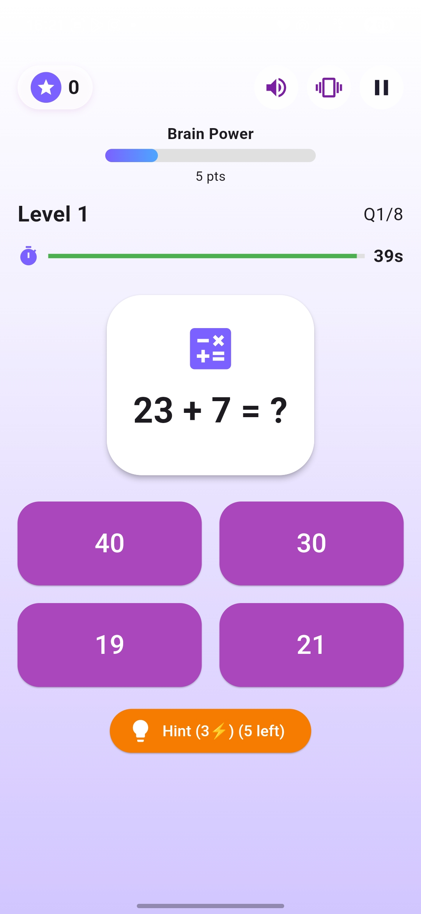
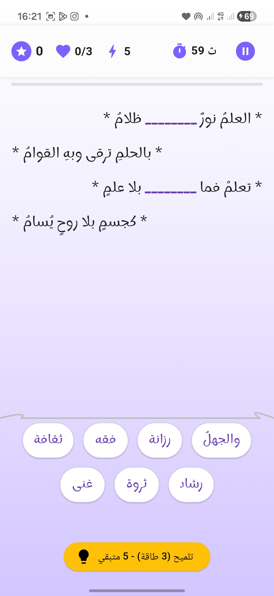
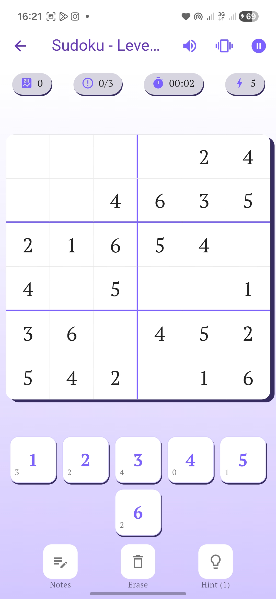
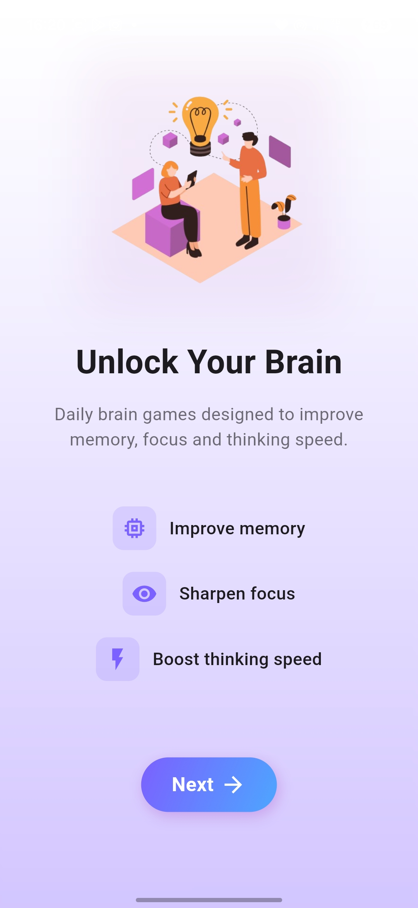
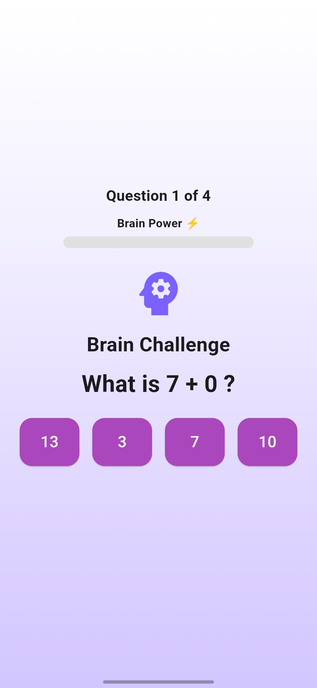
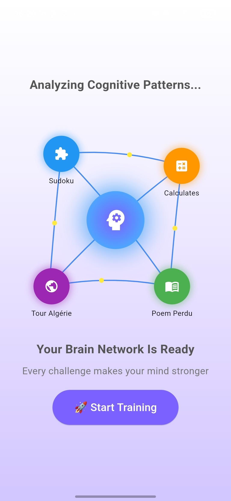

# \# 📱 MemoSchool

# 

# 🔥 A smart educational app that transforms learning into an interactive game experience.

# 

# An interactive educational app designed to improve memory, focus, and learning through engaging mini-games.

# 

# \---

# 

# \## 🚀 Features

# 

# \- 🧠 Brain training games (memory, logic, math)

# \- 🎮 Interactive UI with smooth experience

# \- 📊 Progress-based learning

# \- 🇩🇿 Algeria-focused educational content

# 

# \---

# 

# \## 📸 Screenshots

# 

# \### 🏠 Home \& Navigation

# <p align="center">

# &#x20; 

# &#x20; 

# &#x20; 

# </p>

# 

# \---

# 

# \### 🎮 Games

# <p align="center">

# &#x20; 

# &#x20; 

# &#x20; 

# &#x20; 

# </p>

# 

# \---

# 

# \### 📊 Game Details

# <p align="center">

# &#x20; 

# &#x20; 

# &#x20; 

# &#x20; 

# </p>

# 

# \---

# 

# \### 🚀 Onboarding

# <p align="center">

# &#x20; 

# &#x20; 

# &#x20; 

# &#x20; 

# </p>

# 

# \---

# 

# \## 📦 Download APK

# 

# 👉 \[Download Latest Version](https://github.com/marouanekhadraoui/memoSchool/releases)

# 

# \---

# 

# \## 🛠️ Tech Stack

# 

# \- Flutter

# \- Dart

# \- Custom UI (Canvas / Game logic)

# \- State management

# 

# \---

# 

# \## ⚙️ Installation

# 

# ```bash

# git clone https://github.com/marouanekhadraoui/memoSchool.git

# cd memoSchool

# flutter pub get

# flutter run


# \## 💡 Project Idea

# 

# &#x20;```bash

# &#x20;MemoSchool aims to make learning fun by combining education and gaming.

# The goal is to enhance memory and cognitive skills in an engaging way.


# \## 👨‍💻 Author


# &#x20;```bash

# &#x20;MAROUANE KHADRAOUI


# \## ⭐ Support


# &#x20;```bash

# &#x20;If you like the project, give it a star ⭐


